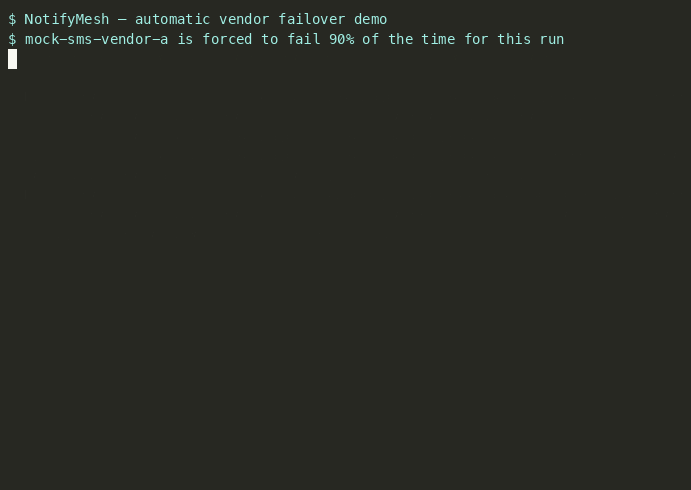
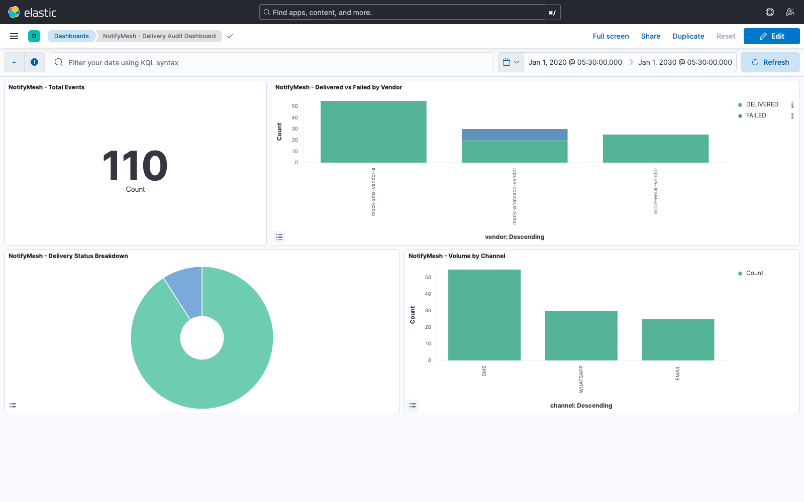

# NotifyMesh

[](https://github.com/mayurt2/notifymesh/actions/workflows/ci.yml)

A multi-channel (SMS/Email/WhatsApp) notification platform with automatic vendor failover, a
Kafka-based event pipeline, and an Elasticsearch-backed delivery audit trail — modeled on a
production system I built handling 6-8K messages/day across multiple SMS vendors.

```
Client
  │  POST /api/v1/notifications
  ▼
ingestion-service ──▶ Kafka: notification.requested
  (validate, Redis idempotency)
                              │
                              ▼
                       router-service
                (VendorRegistry: priority-ordered
                 failover chain per channel)
                              │
                 per vendor: Retry(CircuitBreaker(send))
                 on failure → next vendor in chain
                              │
                              ▼
              Kafka: notification.delivered / .failed
                              │
                              ▼
                       audit-service ──▶ Elasticsearch (notifymesh-deliveries)
                                                  ▲
                                                  │ filters + aggregation
                                          query-service (REST API)
```

Full component/data-flow detail: [`docs/architecture.md`](docs/architecture.md). Autoscaling
design: [`docs/scaling-notes.md`](docs/scaling-notes.md).

## Why I built this

My strongest production work — a multi-vendor SMS gateway with automatic failover, a Kafka
pipeline feeding an Elasticsearch audit index, and the EC2 auto-scaling behind it — is
proprietary and can't live on public GitHub. NotifyMesh is a clean-room rebuild of the same
underlying architecture and decisions (vendor abstraction, circuit-breaker-driven failover,
event-sourced audit trail) using mock vendors instead of real ones, so the engineering is
inspectable end-to-end rather than taken on faith from a resume bullet.

## Screenshots

Failover happening live — `mock-sms-vendor-a` forced to fail, its circuit breaker trips, and
every subsequent request routes straight to the fallback vendor:



Delivery audit dashboard in Kibana, built from the same data this failover demo produces:



## Quick start

Requires Docker + Docker Compose.

```bash
docker compose up -d --build

# wait ~20s for everything to report healthy, then:
curl http://localhost:8081/actuator/health   # ingestion-service
curl http://localhost:8082/actuator/health   # router-service
curl http://localhost:8083/actuator/health   # audit-service
curl http://localhost:8084/actuator/health   # query-service

# submit a notification
curl -X POST http://localhost:8081/api/v1/notifications \
  -H "Content-Type: application/json" \
  -d '{"requestId":"demo-req-1","channel":"SMS","recipient":"+919999999999","body":"hello from notifymesh"}'

# a few seconds later, it's searchable
curl "http://localhost:8084/api/v1/deliveries?channel=SMS"
curl "http://localhost:8084/api/v1/deliveries/stats/vendor-success-rate"
```

To see the Kibana dashboard shown above (Kibana itself doesn't persist saved objects across a
fresh `docker compose up` since Elasticsearch has no volume):

```bash
curl -X POST http://localhost:5601/api/saved_objects/_import \
  -H "kbn-xsrf: true" --form file=@docs/kibana-saved-objects.ndjson
```

then open <http://localhost:5601/app/dashboards>.

## Modules

| Module | Port | Purpose |
|---|---|---|
| `ingestion-service` | 8081 | REST API, publishes to Kafka |
| `router-service` | 8082 | Kafka consumer, vendor selection + failover |
| `vendor-adapters` | — | Shared library: adapter interface + mock implementations |
| `audit-service` | 8083 | Kafka consumer → Elasticsearch |
| `query-service` | 8084 | REST API over Elasticsearch |

## API reference

**`ingestion-service` (:8081)**

| Method & path | Notes |
|---|---|
| `POST /api/v1/notifications` | Body: `{requestId?, channel, recipient, subject?, body}`. `channel` is `SMS`\|`EMAIL`\|`WHATSAPP`. Returns `202` `{requestId, status: ACCEPTED}` or `200` `{requestId, status: DUPLICATE}` if `requestId` was already claimed. |

**`query-service` (:8084)**

| Method & path | Notes |
|---|---|
| `GET /api/v1/deliveries` | Query params (all optional): `channel`, `status` (`DELIVERED`\|`FAILED`), `vendor`, `from`/`to` (ISO-8601 instant, e.g. `2026-07-15T10:00:00Z`), `page`, `size`. Returns `{total, results[]}`. |
| `GET /api/v1/deliveries/stats/vendor-success-rate` | Per-vendor `{vendor, total, delivered, failed, successRate}`, computed via an Elasticsearch terms aggregation, not fetched-and-grouped in application code. |

All four services also expose `/actuator/health` and `/actuator/prometheus`.

## Load test

A real number instead of a proprietary one: `hey -n 2000 -c 50` (2000 requests, 50 concurrent)
against `POST /api/v1/notifications` on a single `ingestion-service` instance, on a single
laptop, alongside the rest of the stack:

```
Total:        0.84 secs
Requests/sec: 2382.56
Latency:      p50 11ms   p95 25ms   p99 354ms
Status codes: 2000x 202, 0 errors
```

The router-service consumer (a single instance) took noticeably longer than 0.84s to drain the
resulting burst on `notification.requested`, since each message involves a simulated vendor
call — but it did drain all 2000 into Elasticsearch with none lost. That gap is the point of
decoupling ingestion from delivery via Kafka: `ingestion-service` doesn't slow down to match the
vendor calls' pace, the topic absorbs the difference.

## Design decisions

**Why Kafka, not a direct HTTP call to the router.** Decoupling ingestion from delivery means a
burst of traffic queues up instead of ingestion blocking on router-service (which itself may be
blocking on a slow vendor). It also gives the audit trail a durable, replayable source of truth —
`audit-service` can be down for a while and catch up from the topic without losing events — and
lets `router-service`'s consumer group scale independently of `ingestion-service`'s request rate
(see [`docs/scaling-notes.md`](docs/scaling-notes.md)).

**Why a circuit breaker on top of retry, not retry alone.** Retry alone handles a single
transient blip well, but against a vendor that's genuinely down, it just delays failure —
every request pays the full retry-and-timeout cost before eventually failing, for as long as the
outage lasts. A circuit breaker tracks each vendor's recent failure rate independently
(`CircuitBreakerRegistry.circuitBreaker(vendorName)` — a distinct instance per vendor, not one
shared breaker for all vendors) and trips open once it crosses a threshold, so once a vendor is
known-bad, subsequent requests skip straight to the next vendor in the chain instead of wasting
a retry cycle on a vendor that's very likely to fail again. Retry handles the "call this one
vendor, is it flaky right now" case; the circuit breaker handles the "is this vendor down"
case, and they're stacked (`Retry(CircuitBreaker(call))`) rather than either one alone.

**How the failover policy works.** Each channel has a priority-ordered vendor list in
`VendorRegistry` (SMS: primary → fallback; Email/WhatsApp: single vendor, since there's nowhere
to fail over to). `DeliveryService` walks the list in order; on exhausted retries or an open
breaker for the current vendor, it moves to the next one. The final outcome — whichever vendor
it landed on, or exhaustion of the whole chain — is what gets published to
`notification.delivered`/`.failed`, tagged with whether failover occurred at all.

**Why `audit-service` and `query-service` don't share an entity class.** Both read/write the
same `notifymesh-deliveries` index, but each defines its own document mapping rather than
importing one from a shared module. That's deliberate: it keeps the write side and read side
independently deployable, at the cost of keeping two mappings in sync by hand for a project this
size (see `docs/architecture.md`).

## What's not production-ready

This is a portfolio project, not a production system, and being upfront about the gap matters
more than pretending it isn't there:

- **Vendor adapters are mocked.** `MockSmsVendorA`/`B`, `MockEmailVendor`, `MockWhatsAppVendor`
  simulate latency and a configurable failure rate; there's no real Twilio/SendGrid/SES/Postmark
  integration. The adapter interface and registry are real; the vendors behind them aren't.
- **No auth.** Every endpoint is open. A real deployment needs at minimum an API key or mTLS on
  `ingestion-service`'s public surface.
- **Kafka publishes are logged-on-failure, not guaranteed.** Both publishers use
  `kafkaTemplate.send(...).whenComplete(...)` to at least log a broker-side failure instead of
  silently dropping it, but there's no outbox pattern or retry-with-backoff on the publish
  itself — a sustained broker outage can still lose an event.
- **Single-broker Kafka, single-node Elasticsearch, no auth on either.** Fine for a local demo;
  a real deployment needs replication and access control on both.
- **No rate limiting.** Redis is used for idempotency but not for per-vendor rate limiting,
  despite that being a natural fit for the same dependency.
- **Query API pagination is offset-based** (`page`/`size`), which is fine at this project's data
  volume but wouldn't hold up at the "100M+ docs" scale the design is modeled on — that needs
  `search_after` or a point-in-time cursor.
- **No Kubernetes manifests.** `docs/scaling-notes.md` describes how I'd autoscale
  `router-service` on Kafka consumer lag via KEDA/HPA, but there's no actual K8s deployment here
  — this runs as `docker-compose` containers.

## Links

- Portfolio: <https://mayur-tarade.github.io/>
- LinkedIn: <https://linkedin.com/in/mayur-tarade>
